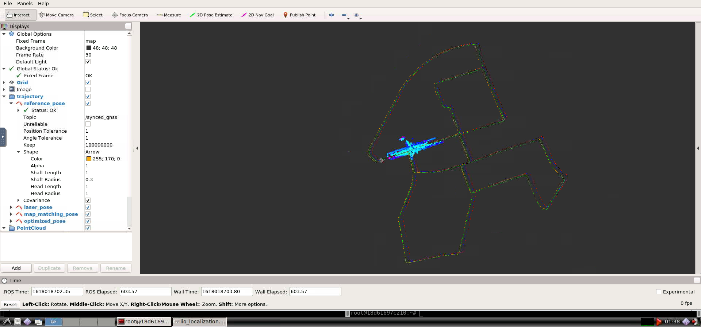
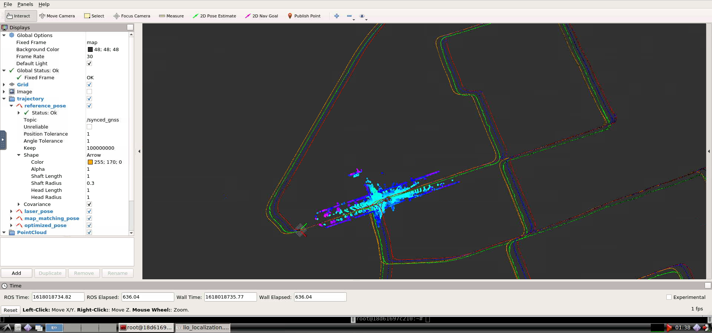
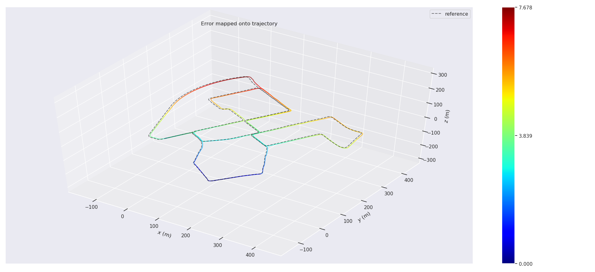

# 第十章作业

基于图优化的滑动窗模型包含：
* 地图匹配位姿和优化变量的残差
* 激光里程计相对位姿和优化变量的残差
* IMU预积分和优化变量的残差
* 边缘化形成的先验因子对应的残差

所以首先需要推导各残差关于优化变量的雅可比

## 1. 推导各残差关于优化变量的雅可比

### 地图匹配位姿和优化变量的残差雅可比

* Residual
  <!-- $$
  e_p = t - t_{obs}
  $$ -->
  

  <!-- $$
  e_{lie} = \ln(R_{obs}^{T}R)^{\vee} = ln(\exp(\phi_{1}^{\hat{}}))^{\vee}
  $$ -->
  %5E%7B%5Cvee%7D%20%3D%20ln(%5Cexp(%5Cphi_%7B1%7D%5E%7B%5Cvee%7D))%0A#card=math&code=e_%7Blie%7D%20%3D%20%5Cln%28R_%7Bobs%7D%5E%7BT%7DR%29%5E%7B%5Cvee%7D%20%3D%20ln%28%5Cexp%28%5Cphi_%7B1%7D%5E%7B%5Cvee%7D%29%29%0A)

* Jacobian (基于扰动模型)
  <!-- $$
  \frac{\partial{e_{p}}}{\partial{t}} = I_3
  $$ -->
  

  <!-- $$
  \begin{aligned}
  \frac{\partial{e_{lie}}}{\partial{\delta{\phi}}} 
  & = \frac{\partial\ln(R_{obs}^{T}R\exp{(\delta\phi^{\hat{}})})^{\vee}}{\partial{\delta{\phi}}} \\
  & = \frac{\partial\ln{(\exp{(\phi_{1}^{\hat{}})}\exp{(\delta{\phi^{\hat{}}})})^{\vee}}}{\partial{\delta{\phi}}} \\
  & \approx \frac{\partial(({\phi_{1}} + J_r(\phi_1)^{-1})\cdot{\delta\phi})}{\partial{\delta\phi}} \\
  & = J_r(\phi_1)^{-1}
  \end{aligned}
  $$ -->

  

### 激光里程计相对位姿和优化变量的残差雅可比

### IMU预积分和优化变量的残差雅可比

### 边缘化形成的先验因子对应的残差雅可比

## 2. 基于图优化的定位

作业是**参考了葛垚大佬的推导**，先完成了代码补全，运行起来看了一下效果

|  | Optimized | LidarOdometry |
|:----:   | :-----: | :-----: |
| Map |  |  |

| APE  | Optimized | LidarOdometry |
|:----:   | :-----: | :-----: |
| max | 8.442891 | 7.678134 |
| mean | 4.747836 | 4.170015 |
| median | 4.815285 | 4.252581 |
| min | 0.000002 | 0.000002 |
| rmse | 5.008378 | 4.514122 |
| sse | 113554.602350 | 92248.011402 |
| std | 1.594337 | 1.728660 |

